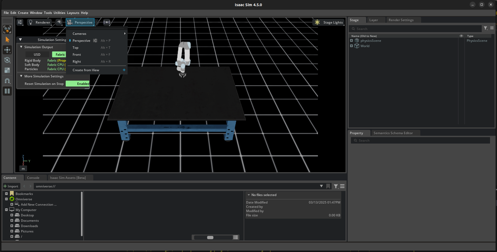
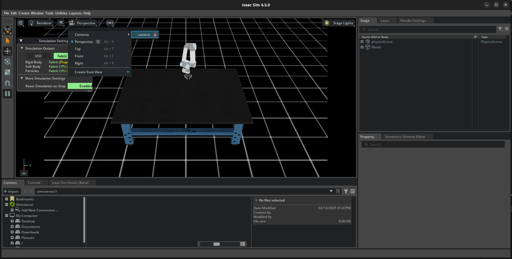

# UR5 Isaac Lab

## Requirements

- Conda environment with Python 3.10
- Isaac Lab installed (see [Isaac Lab installation](https://isaac-sim.github.io/IsaacLab/main/source/setup/installation/pip_installation.html))

## How to Run the Code

1. **Clone the repository:**
    ```bash
    git clone https://github.com/inaki1111/UR5_IsaacLab.git
    ```

2. **Access the repository:**
    ```bash
    cd UR5_IsaacLab
    ```

3. **Activate the conda environment:**
    ```bash
    conda activate isaacsim
    ```

4. **Run the code:**
    ```bash
    python main.py --enable_cameras
    ```


5. **Watch the robot camera**
    
    
